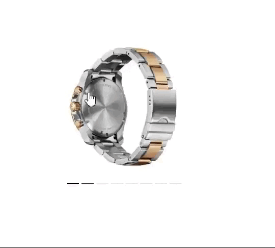

# react-image-slider-change-on-hover

A React hook that allows you to change the active image in a gallery based on the scroll position of the card.

## Installation

You can install this package using npm or yarn:

````bash
npm install react-image-slider-change-on-hover
# or
yarn add react-image-slider-change-on-hover





# react-image-slider-change-on-hover

A React hook that allows you to change the active image in a gallery based on the scroll position of the card.

## Installation

You can install this package using npm or yarn:

```bash
npm install react-image-slider-change-on-hover
# or
yarn add react-image-slider-change-on-hover
API
useImageGalleryChangeOnScroll({ images, x ,cardWidth})
This hook takes an object with the following properties:

images (array): An array of objects, each containing a url property pointing to the image URL.

x (number): The x-position of the mouse on the card, used to determine the active image.

cardWidth : Width of the Card 

The hook returns an object with the following properties:

active (number): The index of the active image.

currentActiveImage (string): The URL of the currently active image.


DEMO CODE

import React, { useEffect } from "react";
import useImageGalleryChangeOnScroll from "react-image-slider-change-on-hover";
import { useMouse } from "@mantine/hooks";

function YourComponent() {
  // Define an array of images with each object containing a 'url' property.
  const images = [
    {
      url: "/images/watches/1.webp",
    },
    {
      url: "/images/watches/3.jpg",
    },
    {
      url: "/images/watches/2.jpg",
    },
    {
      url: "/images/watches/1.webp",
    },
    {
      url: "/images/watches/2.jpg",
    },
    {
      url: "/images/watches/1.webp",
    },
    {
      url: "/images/watches/2.jpg",
    },
    {
      url: "/images/watches/1.webp",
    },
  ];

  const { ref, x } = useMouse();
  // You can use matinedev mouse hook or custom hook to get x (xPositionOfMouse) value of your card

  // Use the `useImageGalleryChangeOnScroll` hook by passing the `images` array and `x` position of the mouse on the card.
  const { active, currentActiveImage } = useImageGalleryChangeOnScroll({
    images,
    x,
    cardWidth
  });

  // Use the `active` and `currentActiveImage` values to update your UI.

  return (
    <div>
      <div
        ref={ref}
        className="cursor-pointer overflow:hidden my-3 p-5 group"
      >
        <div className="">
          <Image
            className=""
            src={currentActiveImage}
            alt={"watches"}
            width={200}
            height={200}
          />
          <div className="flex gap-1">
            {images?.map((item, index) => {
              return (
                <div
                  key={index}
                  className={`transition-all duration-700 hidden group-hover:block border-b-2 w-[100%] ${
                    active >= index ? "border-black" : "text-gray-500"
                  }`}
                ></div>
              );
            })}
          </div>
        </div>
      </div>
    </div>
  );
}


License
This project is licensed under the MIT License - see the LICENSE file for details.
````
